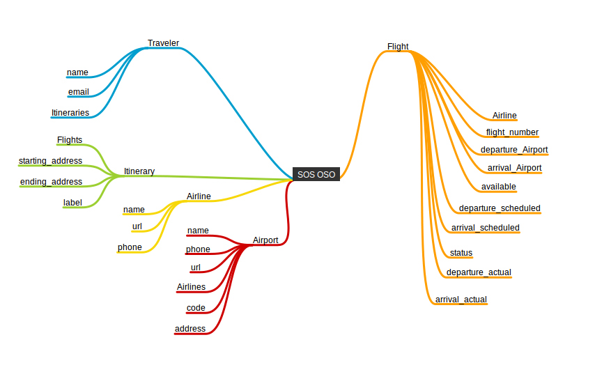

OSO - Cancelled Flight Rerouting
================================

A webapp that makes it easy for you to find an alternate route if your flight or connection is cancelled.

OSO allows travelers to quickly pull up all possible flights to get them to their final destination. It finds *available flights* across *multiple airlines*.

[]

Features
--------

- combines available flights into plausible reroutes
- records and stores multiple personal itineraries
- sends alerts about changes to flights saved to personal itineraries
- look up airport and airline contact information
- Intuitive interface for swapping itineraries on the go

Deployment
----------

TODO
----

- can we book straight through the app?

Get Involved
------------

Credits
-------

License
-------
